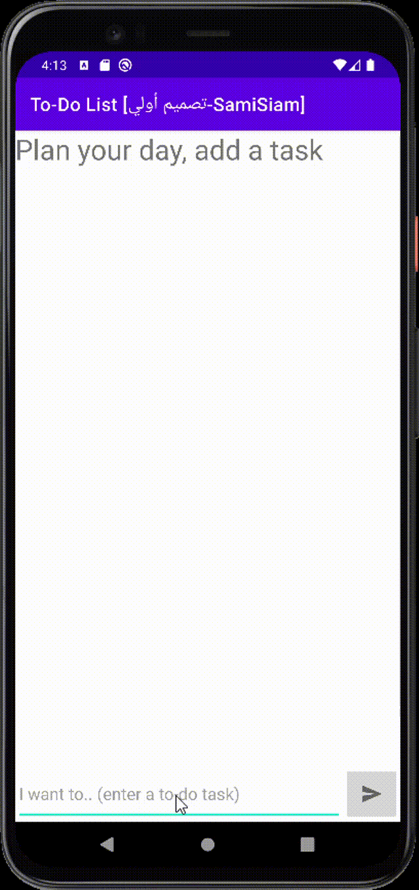
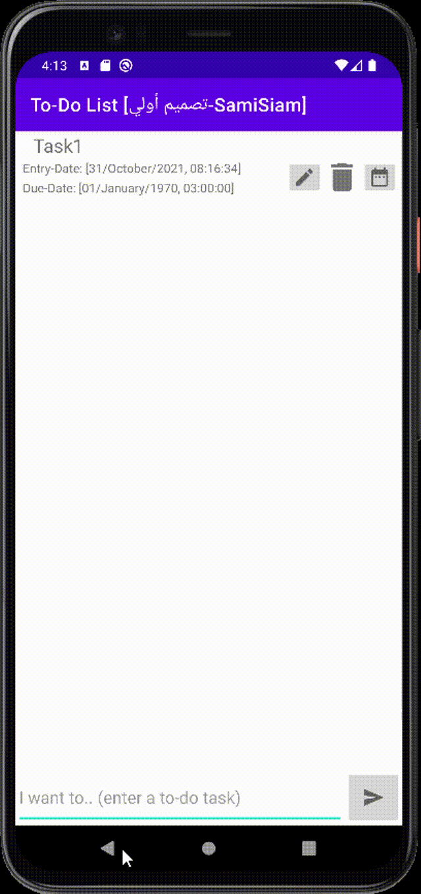
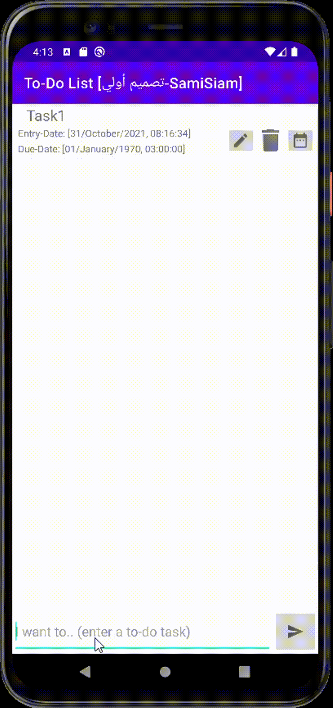
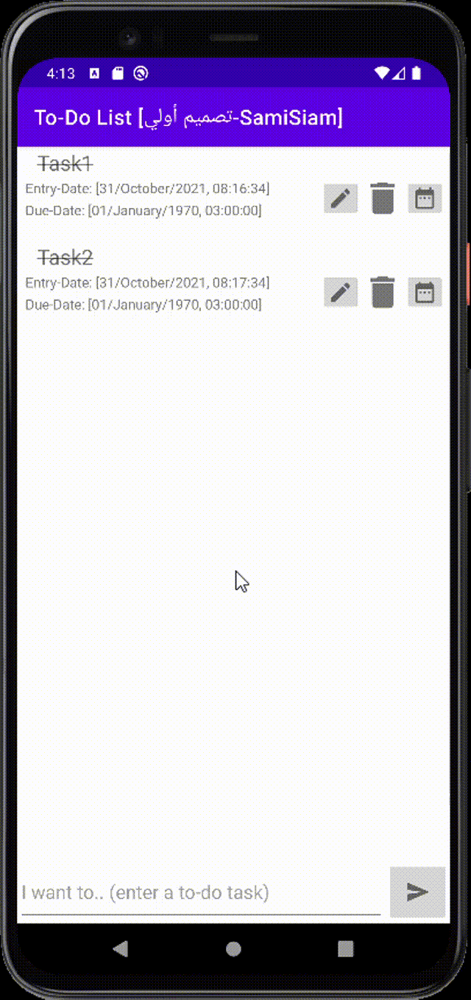
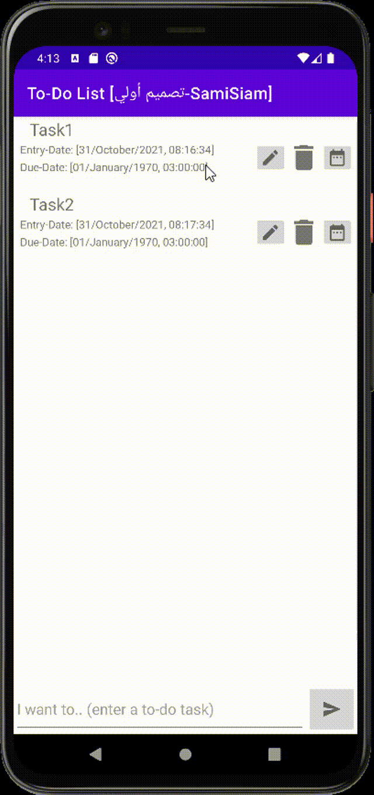

# To-Do-List-PreAlpha-SamiSiam
---

<!--- Replace <SamiAhmedSiam> with your Github Username and <https://github.com/SamiAhmedSiam?tab=repositories> with the name of your repository. -->
<!--- You can find both of these in the url bar when you open your repository in github. -->

## :scroll: Description
---
This is my application description, what you have learned and what you, and what the ideas you have added in this app
## Implemented Kotlin+Android-Studio Concepts/Chapters:
- Recycler View List
- Fragments
- Fragments Navigation
- View Model
- Repository Pattern
- Live Data
- Room Database
- Coroutines
- Parcelize

Required features:
1.Add Task
2.Delete Task
3.Update Task
4.Completion Indication
5.DueDate
6.Description
7."Screen"

Additions: Handling empty recycler view list by making it into a welcoming text. 

## :bulb: Motivation and Context
---
Capstone 1 To-List Application (Individual Project): 
the passion to implement and apply learnt concepts
in previous four weeks of the program.

## :camera_flash: Screenshots
---
### AddTask gif

### DeleteATask gif

### EditATask gif

### Handling Empty RVList gif

### TaskCompletionIndication gif

### Tuwaiq-1000 Program: Jeddah Kotlin1 (Sep2021) ###

# Capstone 1(Individual Project): To-Do List Application
https://tuwaiq-academy.slack.com/archives/C02F94986KG/p1634826103010200

Minimum requirements
Your To Do Application must display tasks in a list:
● The task’s title.
● An indication of whether the task i s completed.
● The task’s due date(if one has been provided by the user):
○ If the task is past due, an indication of this fact I f the user taps on the cell, they should
see a screen for editing additional task details, including:
● The creation date
● All of the information listed above
● An extended description where the user can provide more details about the task
The user must be able to add, delete and edit tasks. The data for the to do l ist must be persistent. No
data should be l ost i f the user terminates and relaunches the application, or i f the user reboots their
device.

### Notes:
- التعليقات باللغة العربية هي خاصة لتوثيق مفاهيم متدرب لغة كوتلين لعمل تطبيقات اندرويد